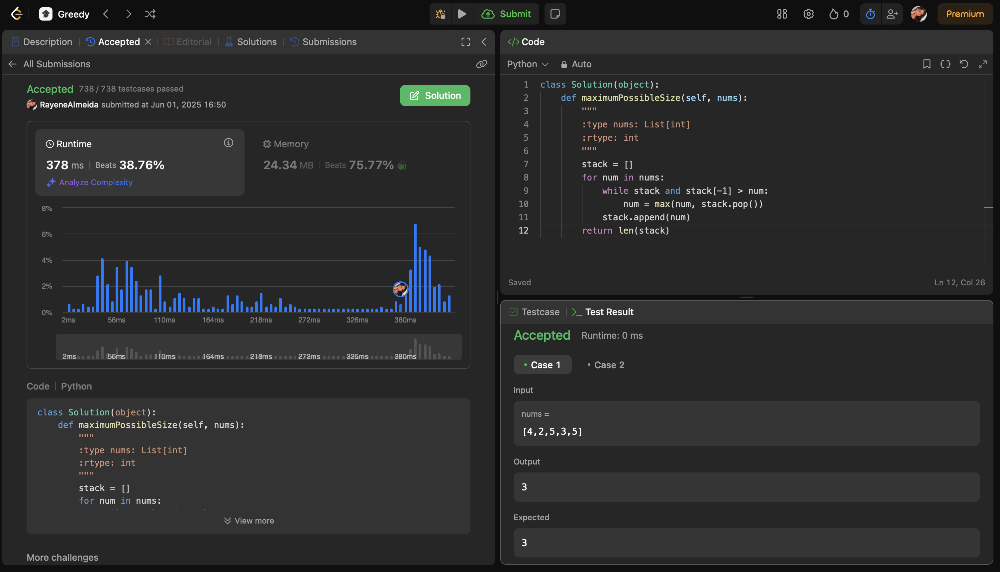
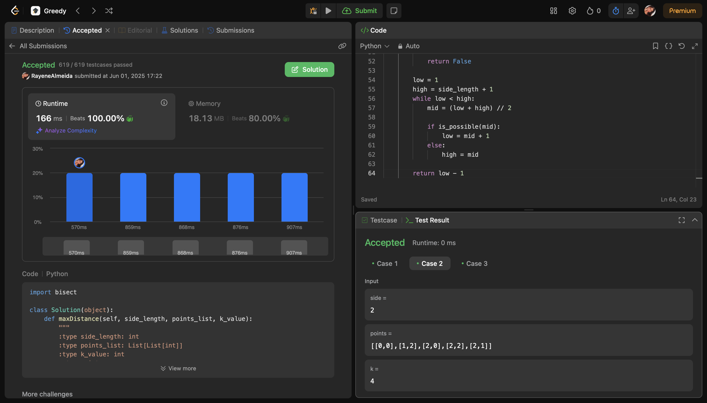
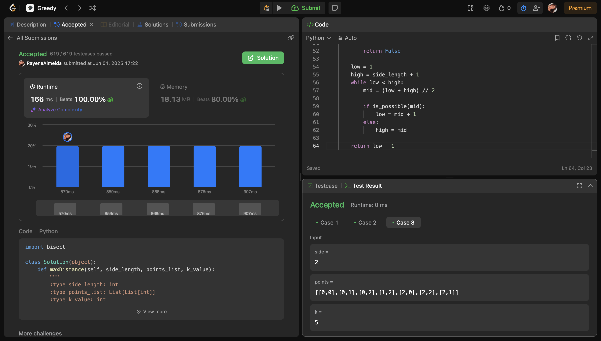
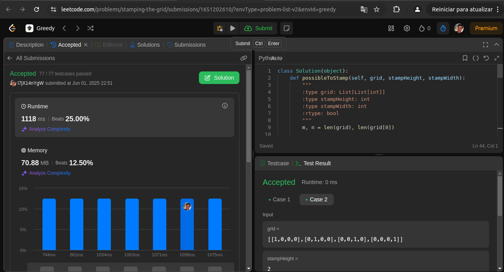
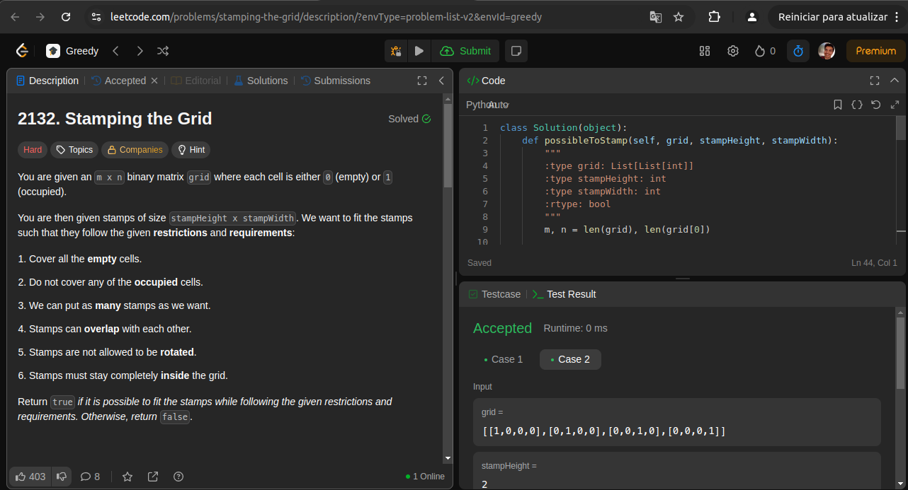
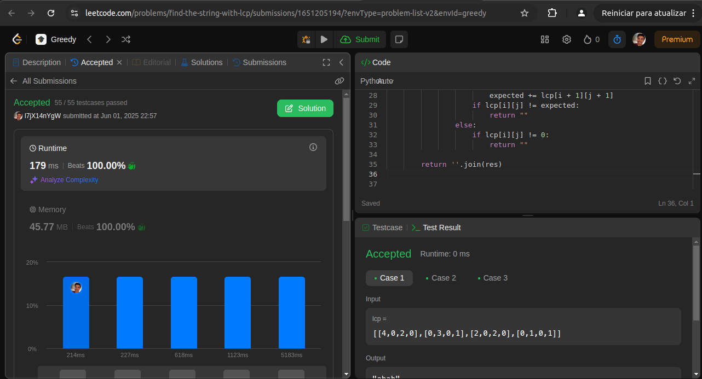
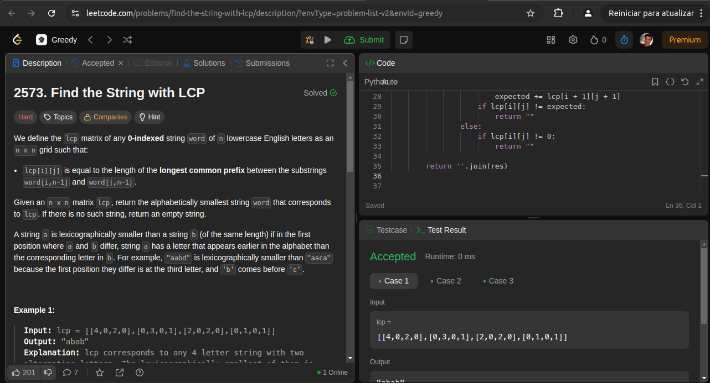

# Greed

**Conteúdo da Disciplina**: Greed

## Alunos
|Matrícula | Aluno |
| -- | -- |
| 22/1022720  | Rayene Ferreira Almeida |
| 17/0108341 | Levi de Oliveira Queiroz |


## Sobre 
O objetivo deste repositório é conter as soluções de problemas nível médio e hard de programação do LeetCode. 


## Screenshots
### [3523. Make Array Non-decreasing](https://leetcode.com/problems/make-array-non-decreasing/?envType=problem-list-v2&envId=greedy)




### [3464. Maximize the Distance Between Points on a Square](https://leetcode.com/problems/maximize-the-distance-between-points-on-a-square/description/?envType=problem-list-v2&envId=greedy)






### [2132. Stamping the Grid](https://leetcode.com/problems/stamping-the-grid/description/?envType=problem-list-v2&envId=greedy)





### [2573. Find the String with LCP](https://leetcode.com/problems/find-the-string-with-lcp/description/?envType=problem-list-v2&envId=greedy)




## Instalação 
**Linguagem**: Python<br>
1. Navegue até a pasta do problema desejado. Ex: `cd 3523`
2. Rode o algoritmo com o comando:

```
python3 solucao.py
```

## Uso 
Apenas execute o código

## Vídeo 

[](https://youtu.be/czFODCGUp9A)
